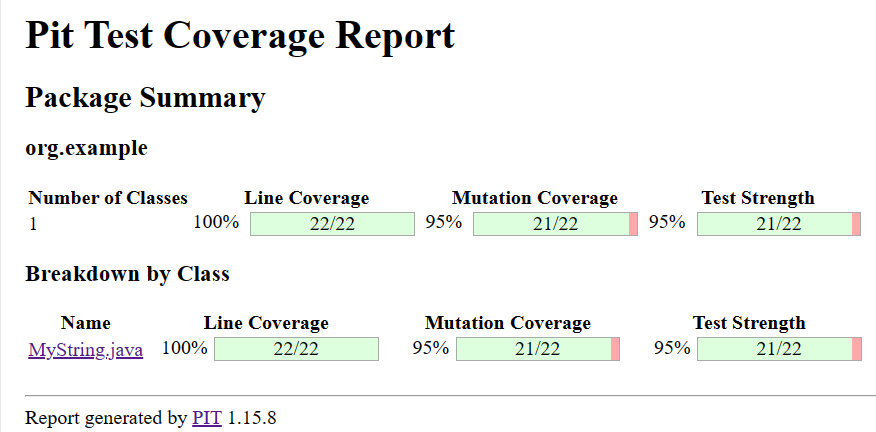

# Assignment 3
## Introduction
This repository contains a Java class `MyString.java` which implements two Java methods：indexOfString() and replace(). The implementation follows the principles of test-driven development (TDD) and the philosophy of specification-based testing approach.

## Implemented Methods
The following methods have been implemented in the `MyString.java` class:

1. `indexOfString(String s1, String s2, int pos)`: The  method receives two strings and an integer to find the first starting index i such that s2 starts at i in s1 and i >= pos. 
   
2. `replace(String s, String s1, String s2) `: The method receives three strings and replaces all the occurrences of s1 with s2 in the string s.

## Usage
The `Main` class show how to use the `MyString.java` class, follow these steps to run it:

1. Clone the repository to your local machine.
   
2. Run class by your IDE derectly OR
   
3. Run following commend:
```
mvn exec:java 
```
4. The test can be ran with:
```
mvn test 
```
5. the mutant coverage report can found in target/pit-reports and you can confiure the converage threshold with following commend:

```
mvn clean test-compile org.pitest:pitest-maven:mutationCoverage -DcoverageThreshold=<default:95> -DmutationThreshold=<default:95> 
```
## Coverage
The line converage of Mystring is 100% and  mutant converage is 95%.



